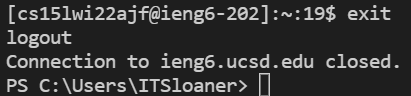
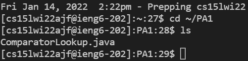
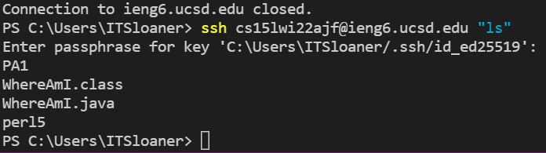

<p align="center">
Lab 1 Week 2 Report
</p>
<br />

### **Installing Visual Studio Code:**
<br />  

First thing's first, you want to go to this 
[link](https://code.visualstudio.com/) and click on the button shown below to download the program. 

<br />   


Once installed, you can open the program and should be greeted with a picture that looks similar to this:


Now you're ready to write code!


<br /> 

### **Remotely Connecting:**

<br /> 

Next you need to learn how to connect to a remote server.


>If you are on a computer with Windows click the link below to learn how to install ssh.


[SSH Download For Windows](https://docs.microsoft.com/en-us/windows-server/administration/openssh/openssh_install_firstuse)


Once installed, reenter VScode and open a terminal. You can do this by pressing **Ctrl** or **Command** + **`** or by clicking this button in the top of the screen. 


To connect to a server you need to type in the ssh command followed by your UCSD course specific account that you can find [here](https://sdacs.ucsd.edu/~icc/index.php).

```
$ ssh [your account name]
```
Say yes to what the terminal asks you and input your password. The output should look similar to this

```
Last login: Fri Jan 2 11:23:15 2022 from 107-217-10-235.lightspeed.sndgca.sbcglobal.net
quota: No filesystem specified.
Hello [acount name], you are currently logged into ieng6-[whatever computer # you are logged into].ucsd.edu

You are using 0% CPU on this system

Cluster Status 
Hostname     Time    #Users  Load  Averages  
ieng6-201   23:25:01   0  0.08,  0.17,  0.11
ieng6-202   23:25:01   1  0.09,  0.15,  0.11
ieng6-203   23:25:01   1  0.08,  0.15,  0.11

Fri Jan 14, 2022 11:23pm - Prepping [name]
```

<br /> 

### **Try Out Some Commands:**

<br /> 

Now that you're connected, you'll be put in some directory within this server. You will be able to move throughout and make changes to the directories and files in this server by using some of the commands below.


* ```ls``` -- Lists the files and subdirectories in your current directory
* ```cd``` -- changes your directory to the path the succeeds the command
* ```pwd``` -- prints the path you are currently in (you can use this to get back to this directory quickly)
* ```mkdir``` -- creates another directory within your current directory; is named whatever string succeeds it
* ```cp``` -- copy tool to either put a copy of a file in a new directory or to rename a file

Play around with the commands to get a better feel of how they work. Make sure to always know what directory you're in.

If you ever want to leave the remote server and return to your local computer, either type in **ctrl** + **d** or type **exit** into the terminal and hit **enter**. It will look like this when you leave the remote server:




<br />

<br />

### **Moving Files From Client to Server:**
<br />  

If you want to move a file on your local computer to the server you're using, we must use the ```scp``` command from your local terminal. The format of the command is shown below:

```
$ scp [File Name including .filetype] [your account name]:[desired path]
```

This means if you have a java file named ComparatorLookup and want it copied to your PA1 folder, the command might look like this:
```
$ scp ComparatorLookup.java cse15lajw@ieng6.ucsd.edu:~/PA1
```
Then you can make sure that it copied correctly going into the correct directory and using the ```ls``` command. It should look something like this:



<br /> 

### **Setting Up an SSH Key:**

<br /> 

Logging into the remote server using the ```ssh``` command can be tedious so there is a way set up so you can enter the server without using your password. Follow the directions below to be able to bypass passwords.

1. Enter ```"ssh-keygen"``` to create the key your computer will use. It should look like this:
```
$ ssh-keygen
Generating public/private rsa key pair.
Enter file in which to save the key (/Users/[your username]/.ssh/id_rsa):
``` 
2. Write or paste the file path you want to save the key in and either create a simple passphrase to use in place of your password or leave it blank for no password.
```
Enter passphrase (empty for no passphrase): 
Enter same passphrase again: 
Your identification has been saved in [Path]
Your public key has been saved in [Path]
```
3. Just like how we set a place for the key to end up on our local computer, we have to set aside a folder for it to end up on the remote server. Make a directory named ".ssh" and leave the remote server.

4. Now that both keys are generated, we need to copy the public key to the remote server. We will follow similar steps as we did in the previous section using the ```scp``` command. Here is the format and an example:

```
$ scp [path to the public key from step 2] [account name]~/.ssh/authorized_keys
```


 
 <br /> 
Now you should be able to log in without any trouble!

<br /> 

### **Optimizing Remote Running:**

<br /> 

Even though we've done our best so far to make it easy to run remotely, some things might still be a little slow when going between the server and the client. Here are some options of things that might make it even simpler:

* This isn't advice that isn't unique to server access, but using the up key while in a terminal, can make everything go by so much quicker because you don't need to rewrite commands and file paths a million times.

* If there's only one command you want to do in the server and immidiately want to leave, you can write your command like this:
 
```
$ ssh [account name] [command in quotes]
```

* Another tip not unique to server access is if you know all the commands you want to run, you can run them at once if you separate them with semicolons on the commandline.
```
$ [command 1]; [command 2]; [command 3]; ... [last command]
```
* Copying and pasting file paths and long account names is always faster than writing them yourself

It's incredible easy to mess up a file path, so its much easier to go into file explorer, click on the the file path up top and copy and past into into the commandline. This only takes 5 inputs on the keyboard (click, *ctrl* + *C*, and *ctrl* + *V*).

An commandline input like 

```
$ cd C:\Users\ITSloaner\OneDrive\Documents\GitHub\cse15l-lab-reports>
```

takes 60 inputs more than just copy and pasting.

 
Also, if I have already set up my ssh key, and been going back and forth between the local and private computers, I could save several keystrokes. For example:

```
$ ssh [account name]
```
Writing this out takes me over thirty inputs on my keyboard. If I have already been using this command frequently i can just press up a few times and it will bring ip the same command, saving me over 20 inputs.

<br>

Let's take these two examples in an example of copying multiple files from a local machine to a remote one. Typing out the entire command

```
$ scp WhereAmI.java cs15lwi22ajf@ieng6.ucsd.edu:~/
```
takes about 48-49 keystrokes. The next one would take much less time because we could use 1 keystroke to move up, have the same input appear, highlight the file we copied (1ish - 2ish keystrokes), and replace it with another by going into your directory (about 2 keystrokes; left click file in explorer and hit rename to have it highlighted) and copy (2 keystrokes) and pasting (2 keystrokes) the name of the file into commandline and pressing enter (1 keystroke). The near 50 keystrokes went down two about 9, saving a lot of time.

<br>
<br>

Try these yourself! You're now ready to work with remote servers.

<br /> <br />
*most of the information on how to do all of this was given on the lab 1 writeup

