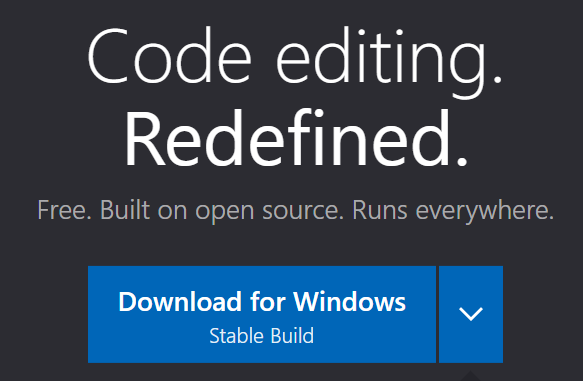
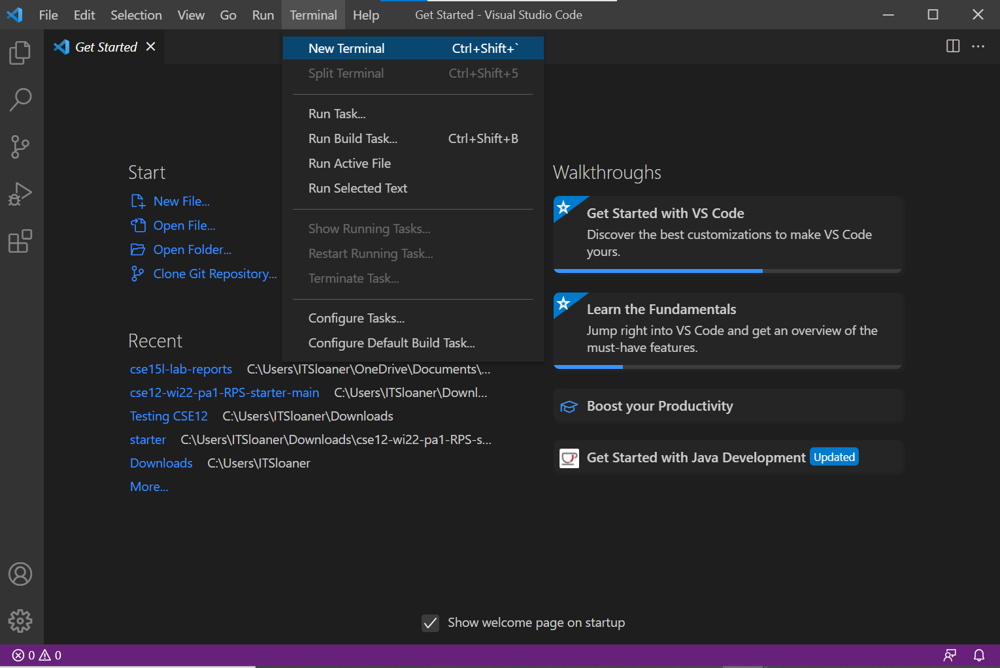
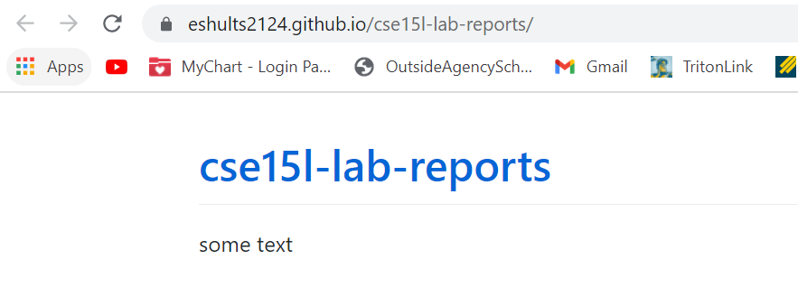

<p align="center">
Lab 1 Week 2 Report
</p>
<br />

### **Installing Visual Studio Code:**
<br />  

First thing's first, you want to go to this 
[link](https://code.visualstudio.com/) and click on the button shown below to download the program. 

<br />   



Once installed, you can open the program and should be greeted with a picture that looks similar to this:


Now you're ready to write code!


<br /> 

### **Remotely Connecting:**

<br /> 

Next you need to learn how to connect to a remote server.

```
If you are on a computer with Windows click the link below to learn how to install ssh.
```
[SSH Download For Windows](https://docs.microsoft.com/en-us/windows-server/administration/openssh/openssh_install_firstuse)


Once installed, reenter VScode and open a terminal. You can do this by pressing **Ctrl** or **Command** + **`** or by clicking this button in the top of the screen. 




<br /> <br />
[Lab Report 1](https://www.youtube.com/watch?v=dQw4w9WgXcQ)


