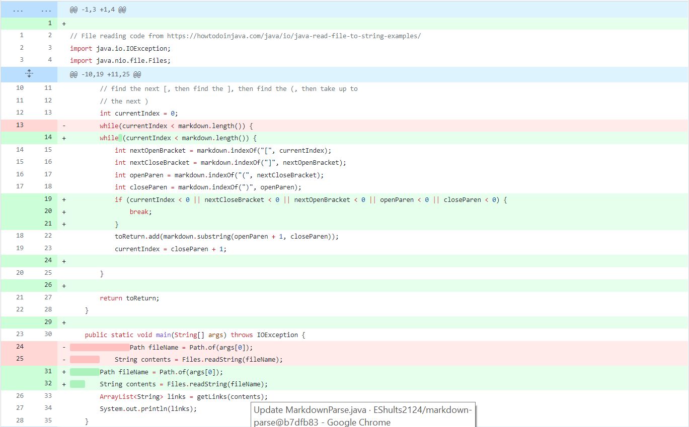

# Lab Report 2: 

## Code Change 1:

Fixed infinite loop when a character was after the link

[Link to Input](https://github.com/EShults2124/markdown-parse/blob/main/CharacterAfter.md)



<br>
Symptom:


Whenever we put any character after the end of the close parenthesis, the code continues in an infinite for loop until a heap space exception is called. This happens because the code expects there to either be either another link following the end of the first one or for the file to end with a ")". This bug originates from the use of the indexOf method, which when it can't locate a particular character, outputs -1; when all of the variables are set to -1, the current index is set to 0 again and the same elements will be put in the list over and over again until the heap fills up.

## Code Change 2:

Confusing Image for Link

[Link to Input](https://github.com/EShults2124/markdown-parse/blob/main/Image.md)


Symptom:


In markdown, the syntax for images and links are very similar, images just have an exclamation before the first open bracket. In this code if you put in an exclamation point immediately before the first bracket, it will still treat it as a link. To fix it, we check if the charAt the index before openParen is an exclamation point.

```
Later on, I fixed a bug that this caused. If the nextOpenBracket is the first character in the file, then we would be checking for the charAt something out of the IndexBounds. I fixed it by creating an extra if statement to check for nextOpenBracket equaling zero. 
```

## Code Change 3:


Fixed it so link will only work if "(" is
right after "]"

[Link to Input](https://github.com/EShults2124/markdown-parse/blob/main/InBetween.md)


Symptom:


This code only checks if there is a "(" after a "]", not how far they are from each other. In markdown, it only reads a link if they are immediately following each other, so because of this bug, it will list the link of anything in parentheses if preceded by brackets at some point. We fixed this by making the code check if the index of the nextCloseBracket + 1 equals openParen so it discounts anything if it's between the two.