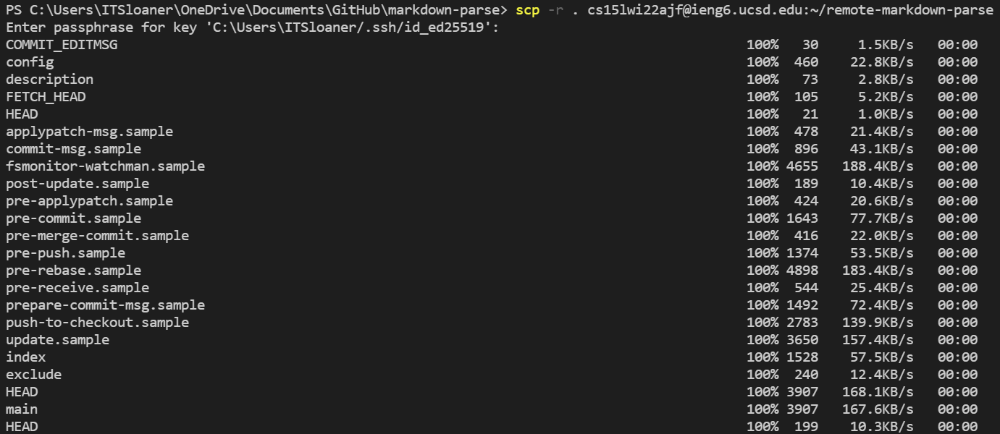

# Copy whole directories with scp -r:

* Show copying your whole markdown-parse directory to your ieng6 account

To copy an entire directory, you need to use the normal scp command but this time recursively so everything is copied. To do this you need to add in a ```-r``` and the path for the directory. The command structure is like this:

```
$ scp -r [to-be copied folder path] [account]:~[new directory name]
```
> If you are copying the directory you are in, you can use ```.``` instead of the full path.

After inputing the command, your terminal will look similar to this:


It will go on for a bit depending on how much is being copied over and it end with all the files that are in the directory being listed:


* Logging into your ieng6 account and compiling and running the tests in the repo you copied


The process to compiling and running a test is very similar to running a normal file, there are just a few extra specifications.

To compile:
```
$ javac -cp .:lib/junit-4.13.2.jar:lib/hamcrest-core-1.3.jar [java file name 1].java [java file name 2].java ...
```

To Run:
```
$ javac -cp .:lib/junit-4.13.2.jar:lib/hamcrest-core-1.3.jar [compiled file name to run]
```

The commands and result should look similar to this:


* copy and test all in one line

If you want to not type in multiple lines, you can use multiple commands separated by semicolons on one line.

In this case it will take the form of: 
```
$ scp -r [to-be copied folder path] [account]:~[new directory name]; [second command]; [third command] ... 
```

After scp is run, you will return immediately to your local terminal so you have to ssh immediately and navigate to the directory to run the tests before exiting.

It will end up looking similar to this:

...


The last two lines shows the two commands we input on the one line earlier; we did not retype them.

I chose to use a makefile to lessen the amount of commands I would write in command line. You can see which commands are in it through the pic above.