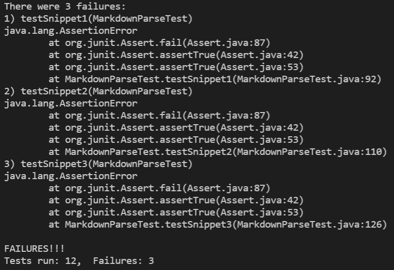
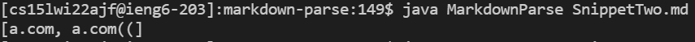

# Testing and Debugging Code

[My Markdown Parse Repo:](https://github.com/EShults2124/markdown-parse) 

[The Other Team's Repo](https://github.com/austin-li/CSE15L-TheLunaMoths)

* A link to your markdown-parse repository and a link to the one you reviewed

* For each test above: 
    * Decide on what it should produce by using either VScode preview or the CommonMark demo site
    * Showing the code in MarkdownParseTest.java for how you turned it into a test
    * For your implementation, the corresponding output when running the tests; if it passed, say so. If it didn’t pass, show the specific part of the JUnit output that shows the test failure.
    * For the implementation you reviewed, the corresponding output when running the tests; if it passed, say so. If it didn’t pass, show the specific part of the JUnit output that shows the test failure.
* Answer the following questions with 2-3 sentences each:
    * Do you think there is a small (<10 lines) code change that will make your program work for snippet 1 and all related cases that use inline code with backticks? If yes, describe the code change. If not, describe why it would be a more involved change.
    * Do you think there is a small (<10 lines) code change that will make your program work for snippet 2 and all related cases that nest parentheses, brackets, and escaped brackets? If yes, describe the code change. If not, describe why it would be a more involved change.
    * Do you think there is a small (<10 lines) code change that will make your program work for snippet 3 and all related cases that have newlines in brackets and parentheses? If yes, describe the code change. If not, describe why it would be a more involved change.

<br/>

## Snippet 1:

<br/>

Expected Output: 

```["`google.com", "google.com", "ucsd.edu"]```

Test Code:


My Running Test: Failure


My Actual Output:

 
LunaMoths' Running Test: Failure


LunaMoths' Output: 


<br/>

## Snippet 2

```["a.com", "a.com(())", "example.com"]```

Test Code:


My Running Test: Failure


My Actual Output:


LunaMoths' Running Test: Failure


LunaMoths' Output: 


## Snippet 3

VSCode and CommonMark Demo Site Disagreed So I will Go With DemoSite
```["https://ucsd-cse15l-w22.github.io/"]```

Test Code:


My Running Test: Failure


My Actual Output:


LunaMoths' Running Test: Failure


LunaMoths' Output: 


## Potential Solutions

* Backticks 

What causes issues is not if there is a backtick within either the brackets or parentheses, but if there are a certain number inside and outside. I don't believe there is a way to fix this very easily/without creating many extra conditions because we have to ensure that it doesn't read it as though box was supposed to contain the open bracket. Also, there are multiple combinations of backticks that do the same thing. If you fix the case for a singular backtick, you have to do the same for large groups of them.

* Nested Parentheses:

One way I can think of that will remedy this bug is having the program keep track of only the last closing parenthesis of the line or the last one before the next open bracket. this will make sure to keep everything nested within the first and last parentheses. The code would probably just be to have another variable that holds the index of the next open bracket and the end of the line. You probably just need to put replace the subset arguments to reflect the last close parenth before the ope bracket.

* New Lines: I think that this symptom is pretty simple to eliminate. Like in a lot of markup implementation, things won't actually move to a new line unless you hit enter twice. So instead of it seeing one \n as a new line, I presume that it only counts if there are exactly two in a row. If you place a new line have something in it, and new line again, it should still work. So we only need to have part of our method track if there are multiple '\n's in succession and then if we find that to be true, just have it skip over adding that link. 


Do you think there is a small (<10 lines) code change that will make your program work for snippet 3 and all related cases that have newlines in brackets and parentheses? If yes, describe the code change. If not, describe why it would be a more involved change.