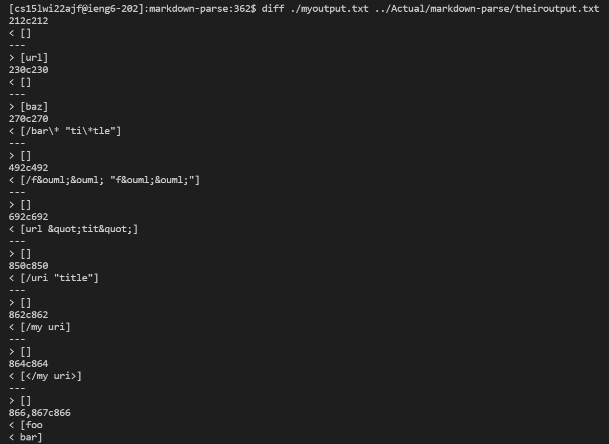
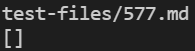
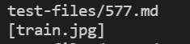
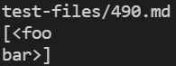
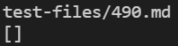

# Lab Report 5

How I found the differences:

1.  Set up two different repositories in ieng6 with the separate implementations of MarkdownParse.java.

2. Changed the .sh file to print out the test name before and output of each commonmark spec tests. 

3. Redirected the output of the bash to separate files. In my case, I named my implementation's text file myoutput.txt and the provided implementation's output file I named theiroutput.txt.

4. To see the differences, I ran the ```diff``` comand.

```
$ diff [filepath1] [filepath2]
```

5. Choose the different outputs you want to address

Example of what the output to diff should look like:



### Test 577

My Output:



Provided Output:




Markdown Display Output:


the getlinks printed output should be -> [ ]

Because this is an image, markdown parse should not add it to the list and it should not be printed. The provided output is incorrect and my output is correct.

The provided markdown-parse code does not have a check for when the character immediately before the first open bracket is !, the signifier for an image vs a link. The writer of this code could probably just right an if statement for if there is an index before openbracket, if it the element at that index is not "!", do not add to toReturn.   

<br/>
<br/>

## Test 490


My Output:



Provided Output:



Actual Output:

[ ]


<br/>

The provided output is correct in this instance and my output is wrong. Nothing should be add to the return list because there is a line break in the middle of the parenthesis. If the line break is at the beginning and end of the parenthetical space, it is ignored, but in this case it breaks up the statement and thus does not follow correct markdown specifications.

To fix this, I can partition a subset inside the parenthetical and run a .contains("/n") and have it not add the statement if it evaluates to true. This partitioned area should be two characters in from either parenthesis for the vast majority of cases. 


